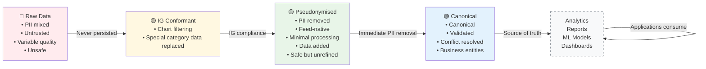

# Somerset Linked Data Platform (LDP) - Discovery Phase

The Somerset LDP aims to connect data across health, care, and other public services to enable better decision-making, improve outcomes for individuals, and support population health management. 

Lucie Laker, Chief Data Officer at Somerset ICS has written an article that provides more information on the LDP and the Discovery phase that underpins the development of the LDP - [Introducing: The Somerset Linked Data Platform](https://medium.com/somerset-ics-ddat-community/introducing-the-somerset-linked-data-platform-47232e312508)

---

## Structure of the Repository

This repository contains a series of technical tests and spikes developed as part of the Discovery Phase for the **Somerset Linked Data Platform (LDP)**. The purpose of this work is to de-risk critical aspects of the project and provide greater certainty as we transition into the build phase of development.

In addition the learning from the technical tests has been incorporated into a set of data ingestion pipelines that take external patient data (subject to the constraints laid out in the project's DPIA and the Data Sharing and Data Processing agreements with those organisations providing patient data for the Discovery).

### Technical tests
Each technical test has it's own sub-folder under [technical-tests](./technical-tests/). Within each sub-folder you'll find a README that details the scope of the test and the outcome of the work.

| Technical test   | Summary                                                                                                                                                                          | Main contact    |
|------------------|----------------------------------------------------------------------------------------------------------------------------------------------------------------------------------|-----------------|
| [Ethnicity coding](./technical-tests/ethnicity/) | This project demonstrates how to manage and translate between different ethnicity code systems using a [FHIR terminology server](https://r4.fhir.space/terminology-module.html). | Will Weatherill |
| [age-bmi](./technical-tests/age-bmi/) | This project demonstrates the ability of our platform to support aggregation over configurable value ranges, such as age brackets or BMI ranges. | Will Weatherill | 
| [pseudonymisation](./technical-tests/pseudonymisation/) | This project holds the research into pseduonymisation options and explains the options that have been chosen and why | Barbara Mrugalska  |         

### Pipelines
The LDP is built on **progressive refinement of data** with each layer having a **single, clear purpose**. This separation of concerns ensures transformations are explainable, auditable, and maintainable.

---

## Contributing

### Technical test
If you are contributing to this repository:
1. Create a new subfolder for your test or spike.
2. Include a `README.md` file that explains:
   - The purpose of the test.
   - The approach taken.
   - The findings or outcomes.
3. Ensure that your code is well-documented and easy to follow.

### Layer
Please follow the [naming convention](./layers/README.md) when creating a new pipeline. Ensure that cloud specific logic is kept isolated from core business logic which should be portable.

## Contact

For questions or further information about the Somerset Linked Data Platform or this repository, please contact hannah.goodall2@nhs.net

