# Layers

This is where all data ingestion pipelines live. The LDP is built on **progressive refinement of data** with each layer having a **single, clear purpose**. This separation of concerns ensures transformations are explainable, auditable, and maintainable.

```mermaid
flowchart LR
    A["🔴 Raw Data<br/>• PII mixed<br/>• Untrusted<br/>• Variable quality<br/>• Unsafe"] 
    B["🟡 IG Conformant<br/>• Apply IG rules<br/>• Minimal changes from raw form<br/>• Chort filtering<br/>• Special category data replaced"]    
    C["🟢 Pseudonymised<br/>• PII removed<br/>• Feed-native<br/>• Minimal processing<br/>• Data added<br/>• Safe but unrefined"]
    D["🔵 Canonical<br/>• Canonical<br/>• Validated<br/>• Conflict resolved<br/>• Business entities"]
    E[" Derived<br/>• Optimized<br/>• Aggregated<br/>• Performant<br/>• Consumer ready"]
    
    A -->|"Never persisted"| B
    B -->|"IG compliance"| C    
    C -->|"Immediate PII removal"| D
    D -->|"Source of truth"| E
    E -->|"Applications consume"|E[Analytics<br/>Reports<br/>ML Models<br/>Dashboards]
    
    style A fill:#ffebee
    style B fill:#fff8e1
    style C fill:#e8f5e8
    style D fill:#e3f2fd
    style E fill:#f8f9fa,stroke:#6c757d,stroke-dasharray: 5 5
```



## Key Principles

- **Left-to-right flow**: Data becomes progressively safer, cleaner, and more usable
- **Single responsibility**: Each layer has one clear purpose and transformation type
- **Immutable progression**: Upstream layers are never modified by downstream processes
- **Quality gates**: Each transition includes validation and quality checks

Each layer in LDP's storage model has a corresponding directory i.e.

```
layers/
├── ig-conformance/ 
│   └─ holds data that meets IG requirements
├── pseudonymised/
│   └─ holds data where PII has been pseudonymised
├── canonical/
    └─ holds data that has been standardised into a canonical model 
```

The pipelines under each dir are intended to output data into the layer that the dir is named after. As an example all pipelines under the `pseudonymised` dir should write data to the pseudonymised layer.

**More info -**
* [IG Conformance layer](./ig-conformance/README.md) - Data is conformant with IG policy around cohort membership and special category data
* [Pseudonymised layer](./pseudonymised/README.md) - A safe, minimal representation of raw input feeds with immediate PII protection
* [Canonical layer](./canonical/README.md) - The source of truth for clean, consistent, canonical data models.

## Pipeline Implementation

The pipeline implementation follows the **single responsibility principle** - each pipeline script is dedicated to populating one specific storage layer. This modular approach ensures that:

- **Clear boundaries**: Each pipeline has a well-defined input source and output destination
- **Independent execution**: Pipelines can be run separately for testing, debugging, or selective processing
- **Failure isolation**: Issues in one layer don't cascade to others - failed pipelines can be re-run independently  
- **Scalable orchestration**: Each pipeline can be scheduled, monitored, and scaled based on its specific requirements
- **Technology flexibility**: Different layers can use different processing technologies without affecting others

### Pipeline naming convention

Each layer holds the pipelines that are designed to feed that layer. Each pipeline script should ideally follow the naming convention `[source system]_[source entity].py`