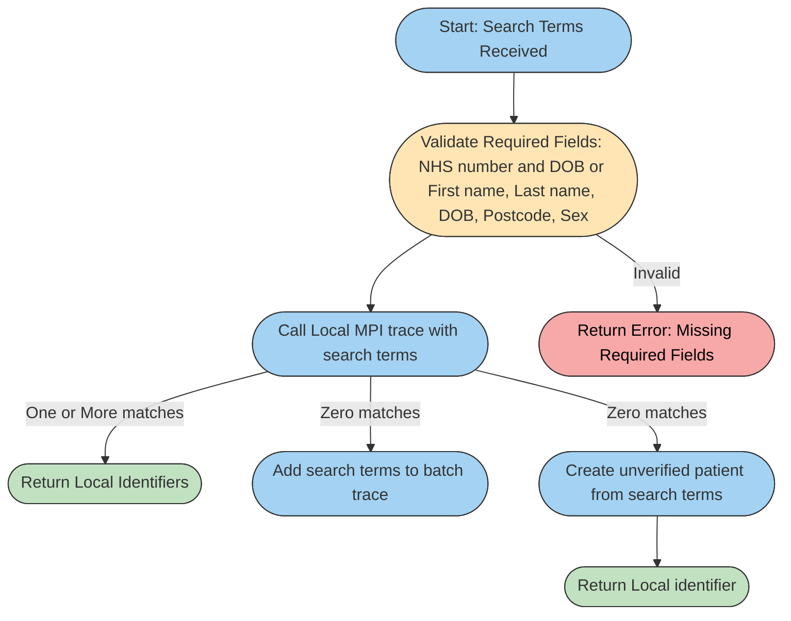
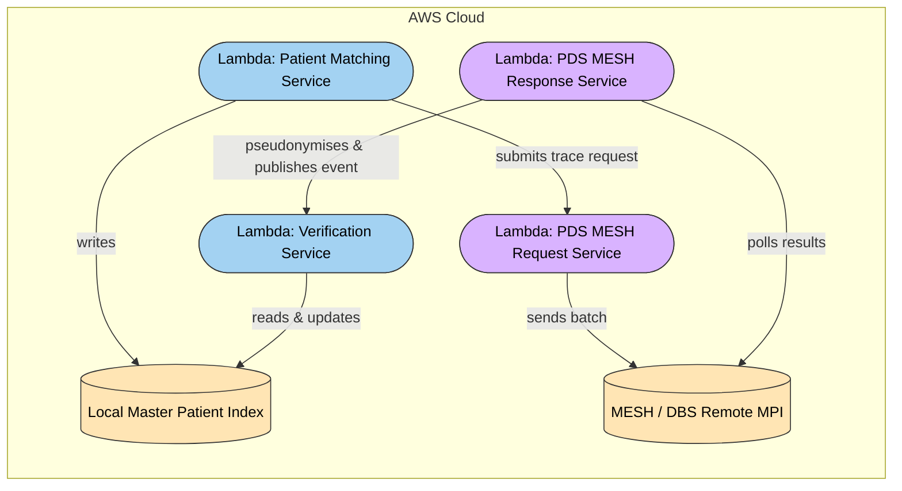

# Patient Services — Matching & Verification

This module encapsulates a master patient index (MPI). It is indented to support data ingestion pipelines where patient records need to be matched against existing patients known to the MPI. The MPI holds 

The matching process is responsible for identifying whether an incoming record represents a patient already known to the platform, or whether it represents a new as yet unseen patient.

Matching proceeds in two stages:

* Local Matching - attempts to resolve the patient within the MPI
* Remote Matching — when local matching fails, the LDP queries the National Personal Demographic Service (PDS) asynchronously to determine whether the patient is known nationally.

The MPI can be thought of as a cache of the records held in PDS. PDS is considered the source of truth. A patient’s identity is not confirmed until PDS confirms it.

If the MPI does not hold a record for a Patient then it means that this is the first time that this Patient’s data has been seen. To avoid blocking on this unknown record two things happen - 

1. The record is added to a set of records that will be submitted to PDS
2. A placeholder unverified Patient is created which is revisited once the remote match completes.

Step 2 is important because it means that ingestion pipelines do not need to block waiting for the asynchronous PDS trace to complete. They can proceed against this unverified patient. 



## Services

The patient module is made up of four services 

| Service           | Description | Depends on                |
|-------------------|-------------|---------------------------|
| Matching          | Performs match against local MPI. If no patient found then triggers creation of unverified patient record in local MPI and adds Patient to PDS MESH request   | -                         |
| PDS MESH Request  | Periodically gathers all unverified and untraced patients from local MPI and submits to PDS  | -      |
| PDS MESH Response | Periodically monitors for PDS trace response. For each response PII data is psedunymised and the raw response deleted. Notifies listeners that a processed response is available | PDS MESH Request  |
| Verification      | Listens for PDS response becoming available and attempts to reconcile trace results with unverified patients in the local MPI in order to mark them as verified | PDS MESH Response |


## Current Implementation status (December 2025)

| Service           | Status      | Depends on                |
|-------------------|-------------|---------------------------|
| Matching          | Complete    | -                         |
| PDS MESH Request  | In progress | PDS MESH integration      |
| PDS MESH Response | Not started | PDS MESH Request service  |
| Verification      | Not started | PDS MESH Response service |

### PDS MESH integration
In order to move forward the PDS onboarding process needs to be started.

---

## Folder Structure

```text
patient/
│
├─ matching/                # holds the matching service designed to be used by ingestion pipelines
│
├─ verification/            # reconciles results from PDS MESH with unverified patient records in the local MPI
│
└─ mpi/                     # holds a local index and integration to a remote index - PDS
    ├─ local/               # the local MPI containing traced and verified patient records
    │
    └─ pds/asynchronous/    # interface into PDS MESH. This layer allows for the addition of a synchronous (PDS-FHIR) integration
        ├─ request/         # takes unverified patient records in the local MPI and triggers a PDS MESH trace
        │
        └─ response/        # pseudonymises the response from PDS MESH and notifies the verification service that results are ready
```


---

## 1. Matching Service (`matching/`)

Provides *synchronous* patient matching during ingestion.  
Returns a stable patient identifier (verified or temporary and unverfified) so ingestion can continue without waiting for remote MPI lookups.

### `aws/lambda/handler.py`
- AWS-facing wrapper.
- Translates event → Python call into `service.py`.
- Contains no business logic.

### `service.py`
- Orchestrates patient matching.
- Performs:
  - Local MPI lookup
  - Invocation of matching algorithms
  - Creation of temporary unverified patients
  - Returning the correct patient reference to the caller

---

## 2. Verification Service (`verification/`)

Runs *asynchronously* when a remote MPI response is available.

### `aws/lambda/handler.py`
- Triggered by an event (SNS/EventBridge).
- Forwards the event into `verifier.py`.

### `verifier.py`
- Reconciles unverified patients with remote match results.
- Performs:
  - Promote/merge/update logic
  - Cleanup of rejected or ambiguous temporary patients
  - Local MPI writes via the repository

---


## 3. Local MPI layer (`mpi/local`)

Holds the local MPI which contains traced and verified patient records

### `repository.py`
- Encapsulates access to the local MPI.
- Handles:
  - Patient search
  - Creation of unverified patients
  - Updating and promotion
  - Merging and deletion

### `matching.py`
- Encapsulates match algorithms. For now only strict matching is supported but fuzzy and/or probabilistic may be possible in the future.

### Database
The service relies on a `patient` table. This is effectively the local MPI and holds all traced and verfified patient records

The `data/migrations` directory contains the migration scripts (see Database section below for more details)

---

## 4. PDS Async Layer (`mpi/pds/asynchronous/`)

Provides the structure for remote MPI / PDS integration.  

### `request/`
Handles batching of outbound PDS trace requests. **Note that this service is incomplete. PDS MESH integration has not been started**

- `aws/lambda/handler.py`  
  Timer-triggered submitter Lambda.

- `service.py`  
  keeps track of existing PDS submissions and coordinates the submission of new trace requests

### `response/`
Handles scheduled polling of inbound PDS/DBS trace responses. **Note that this service is incomplete. The implementation has not been started**

- `aws/lambda/handler.py`  
  Timer-triggered poller Lambda.

### Database
The both the request and response services rely on a `trace_status` table. This tracks those patient records from the local MPI that have been submitted to PDS for tracing. It also tracks which of those records have been successfully traced.

The `data/migrations` directory contains the migration scripts (see Database section below for more details)

---

### Database

For those services that require structured data storage they will contain a directory holding SQL scripts for bootstrapping the database. The intention is that these files will be run in order against a blank database to bring it up to the current version of the schema. Alternatively the execution could begin at a specified file to bring an existing database up to date.

Note that the database, schema and users are expected to be created elsewhere and are not the concern of this module.

The file names follow the convention `<migration_time_in_UTC>__<short_action_description>.sql`. By prefixing with the timestamp of when the migration the order in which the files should be run is implicit i.e. oldest to newest.

The short_action_description should follow the form `verb_object_detail`

**verb** - ∈ {create, add, alter, rename, drop, delete, update}

| Verb     | When to use                                |
| -------- | ------------------------------------------ |
| `create` | New table, index, constraint               |
| `add`    | Adding column, index, constraint           |
| `alter`  | Changing column type, nullability, default |
| `rename` | Renaming table or column                   |
| `drop`   | Removing table, column, index, constraint  |
| `update` | Modifying reference or seed data           |
| `delete` | Removing seed/test/reference data          |

**object** - ∈ {table, column, index, constraint, fk, pk, enum, view, data}

**detail** - describes the specific target e.g. - 

* create_table_patient
* add_column_patient_dob
* alter_column_appointment_status_type
* rename_table_maternity_case_to_birth_record
* drop_index_patient_lastname
* add_fk_patient_gp_id
* update_data_reference_status_codes
* delete_data_test_records

---

## AWS Lambdas

The project exposes four Lambdas both of which are deployed as Docker images - 

* Matching Service - intended to be used by Data pipelines. Returns a stable patient identifier (verified or temporary) so ingestion can continue without waiting for remote MPI lookups
* Verification Service - runs asynchronously sweeping up temporary patient records marking them as verified where appropriate
* PDS MESH Request Service - runs asynchronously sweeping up untraced and temporary patient records submitting them to PDS for tracing
* PDS MESH Response Service - runs asynchronously monitoring for trace responses from PDS, pseudonymising the trace results and notifying listeners (eg Verification Service) that trace data is ready to be processed



### Matching Service 

#### Request/Response format

**Request**
```json
    {
        "patients": [
            {
                "nhs_number": "1234567890",
                "first_name": "John",
                "last_name": "Doe",
                "postcode": "SW1A 1AA",
                "dob": "1980-01-15",
                "sex": "male"
            }
        ]
    }
```

**Successful Response**

```json
    {
      "message": "Patient Linking completed successfully",
      "request_id": "<AWS request ID>",
      "counts": {
        "total": 1,
        "single": 0,
        "multiple": 1,
        "zero": 0        
      }
      "data": [
          {
              "nhs_number": "1234567890",
              "first_name": "John",
              "last_name": "Doe",
              "postcode": "SW1A 1AA",
              "dob": "1980-01-15",
              "sex": "male",
              "patient_ids": ["patient-id-1", "patient-id-2"]
          },
      ]
    }
```

**Error Response**

```json
    {
      "message": "Patient Linking Lambda execution failed",
      "request_id": "<AWS request ID>"
    }
```

#### Environment variables

* `MPI_DB_HOST` - host name of the MPI database server
* `MPI_DB_PORT` - port that the MPI database server is listening on (defaults to 5432)
* `MPI_DB_NAME` - the name of the MPI database to connect to (defaults to ldp)
* `MPI_SCHEMA_NAME` - the name of the MPI schema (defaults to mpi)
* `MPI_DB_USERNAME_SECRET` - the name of the secret holding the MPI database username eg canonical_layer/db_user_name
* `MPI_DB_PASSWORD_SECRET` - the name of the secret holding the MPI database password eg canonical_layer/db_user_password
* `LOG_LEVEL` - an optional variable that alters the default log level of `INFO`. You must supply a valid log level for the Python logging library i.e. `CRITICAL`, `FATAL`, `ERROR`, `WARNING`, `INFO` or `DEBUG`

For testing the `MPI_DB_USERNAME` and `MPI_DB_USERNAME` variables can be set instead of the `*_SECRET` equivalents but this is not recommended for production


### PDS MESH Request Service

#### Request/Response format

**Request**
```json
{}
```
The event is typically empty or contains metadata for the invocation. No patient data is required in the event.

**Successful Response**
```json
{
  "message": "PDS Trace submission completed successfully",
  "request_id": "<AWS request ID>",
  "status": {
    "patient_ids": ["patient-id-1", "patient-id-2", ...],
    "submission_time": "2025-12-10T12:34:56.789Z"
  }
}
```

**Error Response**
```json
{
  "message": "PDS Trace submission failed: <error details>",
  "request_id": "<AWS request ID>"
}
```

#### Environment variables

* `MPI_DB_HOST` - host name of the MPI database server
* `MPI_DB_PORT` - port that the MPI database server is listening on (defaults to 5432)
* `MPI_DB_NAME` - the name of the MPI database to connect to (defaults to ldp)
* `MPI_SCHEMA_NAME` - the name of the MPI schema (defaults to mpi)
* `MPI_DB_USERNAME_SECRET` - the name of the secret holding the MPI database username eg canonical_layer/db_user_name
* `MPI_DB_PASSWORD_SECRET` - the name of the secret holding the MPI database password eg canonical_layer/db_user_password
* `LOG_LEVEL` - an optional variable that alters the default log level of `INFO`. You must supply a valid log level for the Python logging library i.e. `CRITICAL`, `FATAL`, `ERROR`, `WARNING`, `INFO` or `DEBUG`

For testing the `MPI_DB_USERNAME` and `MPI_DB_USERNAME` variables can be set instead of the `*_SECRET` equivalents but this is not recommended for production

### PDS MESH Request Service

**Note that this service is yet to be implemented**

### Verification Service 

**Note that this service is yet to be implemented**

### Building the Docker image

For local development and testing -
```bash
docker buildx build \
  --platform linux/amd64 \
  --provenance=false \
  -t [service-name]:latest \
  -f patient/[service-name]/aws/lambda/Dockerfile .
```

Smoke testing the image- 
```bash
docker run -d --platform linux/amd64 -p 9000:8080 [service-name]:latest

curl "http://localhost:9000/2015-03-31/functions/function/invocations" -d '{}'
```

#### Corporate Network Build (ZScaler)
When building behind corporate firewalls or proxies, include SSL certificates:
Note that the secret id must be named `ssl-certs` and points to the path of your corporate SSL cert

```bash
docker buildx build \
  --secret id=ssl-certs,src=/etc/ssl/certs/ca-certificates.crt \
  --platform linux/amd64 \
  --provenance=false \
  -t patient-[service]:latest \
  -f patient/[service]/aws/lambda/Dockerfile .
```

